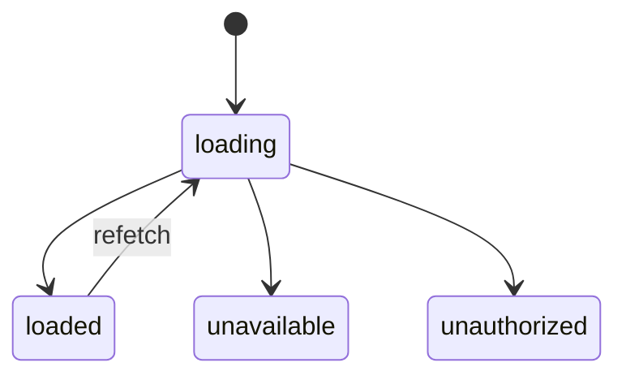

<div class="flex items-center justify-center h-full">
  
</div>

---

<PartSlide title="How to Build Local-First Apps with Vue" subtitle="Vue Amsterdam 2026 - Alexander Opalic" />

<!--
[breathe] [scan room]

Excited to be here -- favorite topic
Local-first + Vue

Newer community, growing FAST
Introductory talk -- build your own by the end

TRANSITION: Quick intro...
-->

---

<div class="flex items-center justify-center h-full">
  
</div>

---

# About me

<About />

<!--
Quick intro from my side

Alexander Opalic -- Vue 8+ years, backend too
Germany, OTTO Payments -- e-commerce
Blog posts + talks on topics I love

TRANSITION: Quick show of hands...
-->

---
layout: statement
transition: fade-out
---

# Raise your hand if you've ever built an app that works offline

<!--
[scan room]

Quick survey -- how familiar are you?

[wait 3 seconds]

TRANSITION: Now keep those hands up...
-->

---
layout: statement
transition: fade-out
---

# Keep it up if you've heard of local-first

<v-click>

# And who has actually built a local-first app?

</v-click>

<!--
[scan room] [wait 3 seconds]

Way fewer hands -- THAT gap is why we're here

[click] Even fewer -- and that's totally fine, that's exactly why this talk exists

[pause]
-->

---

<PyramidOutline :items="[
  { title: 'The Status Quo', subtitle: 'Vue abstracts the DOM, not the data' },
  { title: 'Offline-First', subtitle: 'The app that works without WIFI' },
  { title: 'Sync Engines', subtitle: 'The new data layer' },
  { title: 'Local-First', subtitle: 'More than just offline' },
  { title: 'Jazz', subtitle: 'Local-first Vue in practice' }
]" />

<!--
Overview -- universe is big, structured like this:

- Status quo -- how apps are built today
- Offline-first -- work without WiFi
- Sync engines -- the new data layer
- Local-first -- what it really means
- Jazz -- build it for real

TRANSITION: Let's start at the bottom -- the status quo.
-->

---
transition: fade
---

<PartSlide part="0" title="The Status Quo" subtitle="Vue Abstracts the DOM, Not the Data" />

<!--
[scan room]

Where we are NOW -- how most Vue apps are built
-->

---
clicks: 2
---

<div class="flex items-center justify-center h-full">
<DuplicatedArchDiagram
  :panels="[
    {
      title: 'FRONTEND',
      click: 1,
      items: [
        { id: 'ref', label: 'ref([])', click: 1 },
        { id: 'loading', label: 'loading = true', click: 1 },
        { id: 'try', label: 'try { ... }', click: 1 },
        { id: 'catch', label: 'catch { ... }', click: 1 },
        { id: 'finally', label: 'finally { ... }', click: 1 },
        { id: 'cache', label: 'invalidateCache()', click: 1 },
      ],
      warnings: [
        { text: '⚠ validation' },
        { text: '⚠ auth checks' },
        { text: '⚠ error types' },
      ],
      warningClick: 2,
    },
    {
      title: 'BACKEND',
      click: 1,
      items: [
        { id: 'get', label: 'app.get(\'/todos\')', click: 1 },
        { id: 'validate', label: 'validate(...)', click: 1 },
        { id: 'insert', label: 'db.insert(...)', click: 1 },
        { id: 'auth', label: 'authorize(...)', click: 1 },
      ],
      warnings: [
        { text: '⚠ validation' },
        { text: '⚠ auth checks' },
        { text: '⚠ error types' },
      ],
      warningClick: 2,
    },
  ]"
  :connections="[
    { label: 'GET', click: 1 },
    { label: 'POST', click: 1 },
  ]"
  :database="{ label: 'query / write', click: 1 }"
  :callout="{ label: 'DUPLICATED', click: 2, variant: 'danger' }"
  :seed="150"
/>
</div>

<!--
Classical 3-tier -- state DUPLICATED in two places
Frontend: refs, Pinia
Database: also the state

Even simple CRUD = lots of code

CLICK

Duplicated: validation, auth, error types
Frontend doing TOO much -- leads to bugs

TRANSITION: Kyle Mathews has a great analogy...
-->

---
layout: quote
transition: fade
---

<QuoteCard author="Kyle Mathews - Co-founder of ElectricSQL, creator of Gatsby" highlight="jQuery era of data">
  We're in the jQuery era of data.
</QuoteCard>

<!--
QUOTE: Kyle Mathews -- Gatsby founder, now ElectricSQL
Source: Sync Conf panel discussion

[slow down]
jQuery = fiddling with DOM manually
Vue freed us

BUT -- same dance with DATA
Fetch, cache, retry, invalidate

[pause] History repeating

TRANSITION: Where we are in this evolution...
-->

---
---

# But Who Solves Data Sync?

<FlowDiagram
  :nodes="[
    { id: 'jquery', label: 'jQuery Era', subtitle: 'YOU → DOM', variant: 'muted' },
    { id: 'vue', label: 'Vue Era', subtitle: 'ref() → VDOM → DOM' },
    { id: 'now', label: 'Now', subtitle: '??? → ??? → DB', variant: 'accent' },
  ]"
  :edges="[
    { from: 'jquery', to: 'vue' },
    { from: 'vue', to: 'now' },
  ]"
/>

- jQuery era: **YOU** were the sync engine for the DOM
- Vue era: **Vue** became the sync engine for the DOM
- Now: Who's the sync engine for **DATA**?

<!--
jQuery -- YOU were the sync engine
getElementById, appendChild, manual everything

Vue -- FRAMEWORK syncs the DOM
Declarative. Reactive.

Now -- who syncs the DATA?

[pause]
Same pattern, one layer UP
Vue solved rendering -- need something for data

TRANSITION: What about tools you already use?
-->

---

# "But I Already Use TanStack Query / Pinia?"

<div class="grid grid-cols-2 gap-4 mt-3">

<div v-click>
<div class="font-bold text-brand mb-2 text-sm">TanStack Query - server cache</div>

```ts
const { data } = useQuery({
  queryKey: ['todos'],
  queryFn: fetchTodos,
})
// edit a todo → mutate → refetch
await updateTodo(1, body)
client.invalidateQueries(['todos'])
```

</div>

<div v-click>
<div class="font-bold text-brand mb-2 text-sm">Pinia - client state</div>

```ts
const ui = useUiStore()
ui.sidebarOpen = true
ui.formDraft = 'Buy milk'
ui.theme = 'dark'
// page refresh?
// formDraft is gone
// no persistence, no sync
```

</div>

</div>

<div v-click class="mt-3 mx-auto w-2/3">
<div class="font-bold text-brand mb-2 text-sm">Sync engine - local truth</div>

```ts
const todos = useQuery(db.todos)
db.todos.insert({ text: 'Buy milk' })
// instant - local DB write | works offline | syncs to all devices
```

</div>

<!--
"I already use TanStack / Pinia" -- why something else?

CLICK -- TanStack = server cache. Fetch, cache, invalidate, repeat. Yes, it has optimistic mutations -- but you're still duct-taping over the round-trip.

CLICK -- Pinia = client state. Refresh? Gone.

CLICK -- Sync engine = DIFFERENT layer. Write locally, instant, offline, syncs everywhere.

CLICK -- Replace the fetch-cache-invalidate cycle ENTIRELY.

TRANSITION: Where that leaves us on the scorecard...
-->

---

# The Status Quo Scorecard

<Scorecard mode="intro" :achieved="[]" :show-summary="false" />

<div v-click="8" class="mt-4 text-center text-gray-500">

Vue solved **rendering**. But the data layer? Still the jQuery era. **0 out of 7.**

</div>

<div v-click="9" class="mt-6 text-center">
  <span class="text-sm text-gray-400 italic">The 7 ideals from </span>
  <a href="https://www.inkandswitch.com/essay/local-first/" target="_blank" class="text-sm font-semibold italic" style="color: #ff6bed">"Local-First Software"</a>
  <span class="text-sm text-gray-400 italic"> - Ink & Switch, 2019</span>
</div>

<!--
5. Longevity — "Your work should continue to be accessible indefinitely, even after the company that produced the software is gone."
6. Privacy — "Your local devices store only your own data, avoiding the centralized cloud database holding everybody's data."
7. User control — "You should be able to copy and modify data in any way, write down any thought, and no company should restrict what you are allowed to do."

CLICK -- Not random criteria
STAT: 7 ideals from Ink & Switch paper, 2019

CLICK -- Typical Vue app? ZERO out of seven

[pause] [look up]
Rendering = solved. Data layer = not started.
Let's change that.

[wait for reaction]
-->

---

# How Do Today's Web Apps Score?

<WebAppsScorecard />

<div class="mt-3 text-center text-sm text-gray-500">

Source: <a href="https://www.inkandswitch.com/essay/local-first/" target="_blank" style="color: #ff6bed">"Local-First Software"</a> — Ink & Switch, 2019

</div>

<!--
From the original Ink & Switch paper -- how do REAL apps score?

Google Docs. Fast? Depends on connection. Multi-device, collaboration? Yes. Offline? Partial. Privacy? No -- Google reads your data.

Trello. Similar story. No privacy, no user control.

 Pinterest. Even worse. Fully cloud-dependent.

Dropbox. Different pattern! Fast, longevity, user control -- but no real-time collaboration.

Git + GitHub. Best score so far! Fast, offline, longevity, user control. But collaboration is only partial -- merge conflicts, anyone?

Notice: NO app gets all seven. Cloud apps nail collaboration but fail privacy/control. Dev tools nail control but fail collaboration. That's the gap local-first fills.

TRANSITION: Let's start fixing this -- offline-first.
-->

---
transition: fade
---

<PartSlide part="1" title="Offline-First" subtitle="The App That Works Without WiFi" />

<!--
[scan room]

Flip the model -- data lives on CLIENT first
Syncs to server when it can
-->

---
clicks: 7
---

# Local Storage Options

<StorageFunnelDiagram
  :rejected="[
    { id: 'ls', label: 'localStorage', subtitles: ['~5 MB limit', 'Sync API (blocks UI)', 'Strings only'], status: 'rejected', click: 1 },
    { id: 'ss', label: 'sessionStorage', subtitles: ['Tab-scoped only', 'Gone on close', '~5 MB limit'], status: 'rejected', click: 2 },
    { id: 'ck', label: 'Cookies', subtitles: ['~4 KB limit', 'Sent with every request', 'Not for app data'], status: 'rejected', click: 3 },
  ]"
  :accepted="[
    { id: 'idb', label: 'IndexedDB', subtitles: ['Generous storage quota', 'Async API', 'Structured data'], status: 'accepted', click: 4 },
    { id: 'sql', label: 'SQLite (WASM)', subtitles: ['Full SQL queries', 'OPFS persistence', '~900KB bundle'], status: 'accepted', click: 5 },
    { id: 'pg', label: 'PGlite (Postgres WASM)', subtitles: ['Full Postgres in the browser', 'pgvector & extensions', '<3MB gzipped'], status: 'accepted', click: 6 },
  ]"
  summary="For local-first: IndexedDB (native), SQLite WASM (SQL power), or PGlite (full Postgres)"
  :summary-click="7"
/>

<!--
localStorage. 5 MB, sync API, strings only. Not enough.

sessionStorage. Tab-scoped. Close tab = gone.

Cookies. 4 KB. Not for app data.

IndexedDB. NOW we're talking. Unlimited, async, structured.

SQLite WASM. Full SQL in WebAssembly. Uses OPFS -- Origin Private File System -- for persistence.

PGlite. Full Postgres in WASM, <3MB gzipped. pgvector + extensions.

Bottom line: IndexedDB, SQLite WASM, or PGlite.
Most sync engines pick one for you.
-->

---
layout: center
---

# Want to go deeper on SQLite?

<div class="flex flex-col items-center">
  <Youtube id="7yNG1aj7-Aw" width="560" height="315" />
  <p class="mt-2 opacity-70">Conrad Hofmeyr (PowerSync) - "SQLite Persistence on the Web" @ Sync Conf 2025</p>
</div>

<!--
Quick shout-out -- if SQLite in the browser sounds interesting,
-->

---
clicks: 2
---

# The Offline-First Architecture

<SplitDiagram
  :panels="[
    {
      title: 'ONLINE',
      click: 1,
      nodes: [
        { id: 'local', label: 'Local Store', subtitle: '(IndexedDB / SQLite)', variant: 'accent', leftLabel: '◀── read', rightLabel: 'write ──▶', click: 1 },
        { id: 'server', label: 'Server DB', variant: 'success', click: 1 },
      ],
      edges: [
        { from: 'local', to: 'server', label: 'sync ↕', click: 1 },
      ],
    },
    {
      title: 'OFFLINE',
      click: 2,
      nodes: [
        { id: 'local2', label: 'Local Store', subtitle: '(IndexedDB / SQLite)', variant: 'accent', leftLabel: '◀── read', rightLabel: 'write ──▶', click: 2 },
        { id: 'pending', label: 'Pending Writes', variant: 'muted', click: 2 },
      ],
      edges: [
        { from: 'local2', to: 'pending', label: 'saved locally', click: 2 },
      ],
      badges: [
        { text: '✗ no network', position: 'inline', variant: 'danger', click: 2 },
        { text: 'Still works! → syncs when back online', position: 'bottom', variant: 'success', click: 2 },
      ],
    },
  ]"
  :seed="200"
/>

<!--
[gesture] Online side: read/write LOCAL. Sync in background.

Offline side: network drops - app writes to IndexedDB first.
Transactions are saved locally as pending writes.
When connectivity returns, they sync to the server automatically.

[look up] App NEVER stops working

TRANSITION: But there's a gotcha most people miss...
-->

---
clicks: 2
---

# The PWA Gotcha

<PwaDiagram
  :panels="[
    {
      title: 'WITHOUT PWA',
      titleIcon: '❌',
      click: 1,
      boxes: [
        { id: 'error', label: '🦕 Chrome Dino', subtitle: 'No Internet', variant: 'danger', click: 1 },
      ],
      arrows: [],
      annotations: [
        { text: 'IndexedDB has data...', variant: 'muted', click: 1 },
        { text: 'but who cares?', variant: 'muted', click: 1 },
        { text: 'App cannot even load.', variant: 'danger', click: 1 },
      ],
    },
    {
      title: 'WITH PWA',
      titleIcon: '✅',
      click: 2,
      boxes: [
        { id: 'sw', label: 'Service Worker', subtitle: 'intercepts fetch', variant: 'accent', click: 2 },
        { id: 'cache', label: 'Cache Storage', subtitle: 'HTML, JS, CSS, WASM', variant: 'default', click: 2 },
      ],
      arrows: [
        { from: 'sw', to: 'cache', click: 2 },
      ],
      annotations: [],
      resultText: 'App loads!',
      resultIcon: '🚀',
      resultVariant: 'success',
      resultClick: 2,
    },
  ]"
  :seed="300"
  :panelHeight="280"
/>

<!--
Data in IndexedDB -- but app shell can't LOAD offline?
None of it matters. Chrome dino.

Without PWA = dino
With PWA = Service Worker intercepts, serves from cache

[look up] PWA is the foundation. Data layer sits on top.
-->

---

# Want to Learn More About PWAs?

<div class="grid grid-cols-2 gap-8 mt-8 items-center">
  <div class="flex flex-col items-center">
    
  </div>
  <div class="flex flex-col items-center">
    
    <div class="mt-4 text-sm op-50">
      Scan to read the post
    </div>
  </div>
</div>

<!--
PWA + Vue 3 + Vite -- blog post, 4 steps
Scan QR later
-->

---

<OfflineStackDiagram />

<!--
[gesture] Three layers:
- Top: Vue / Nuxt components
- Middle: IndexedDB or SQLite WASM
- Bottom: Service Worker -- caches the shell

vite-plugin-pwa or @vite-pwa/nuxt -- easy to add

TRANSITION: What does offline-first already give us?
-->

---

# What Offline-First Already Gives Us

<Scorecard :achieved="['fast', 'offline']" :descriptions="{
  fast: 'Data is local. Reads are instant. No waiting for the network.',
  offline: 'The whole point. Read and write without connectivity.'
}" />

<!--
CLICK -- Two things FREE: speed (local reads) + offline capability

CLICK -- Five question marks still open

CLICK -- 2 out of 7. Good progress, NOT enough.

TRANSITION: What's holding us back?
-->

---
clicks: 5
---

# The Missing Piece: How Do You Sync?

<TodoSyncConflictDemo :roughness="1.2" :seed="900" />

<!--
Data stored locally -- great. But TWO devices, same todo.

CLICK -- Both go offline. Can't see each other.

CLICK -- Device A: "Buy oat milk"

CLICK -- Device B: "Buy almond milk"

CLICK -- Reconnect. Now what? Which wins?

CLICK -- Distributed systems problem. Needs a SYNC ENGINE.
-->

---
transition: fade
---

<PartSlide part="2" title="Sync Engines" subtitle="The New Data Layer" />

<!--
[scan room]

Now things get REALLY interesting
-->

---
---

<ClientServerDiagram
  :clients="[
    { title: 'Client A', layers: [{ label: 'App code' }] },
    { title: 'Client B', layers: [{ label: 'App code' }] },
  ]"
  server-label="API server"
  connection-label="fetch()"
  server-db-label="SQL"
  database-label="Database"
  caption="Sharing data with APIs"
  :seed="300"
/>

<!--
[gesture] Traditional: every client talks to server via HTTP
Server = single source of truth

Works -- but network goes away?
-->

---
---

<ClientServerDiagram
  :clients="[
    {
      title: 'Client A',
      layers: [
        { label: 'App code' },
        { label: 'Sync client', variant: 'accent' },
        { label: 'Local DB', variant: 'success' },
      ],
    },
    {
      title: 'Client B',
      layers: [
        { label: 'App code' },
        { label: 'Sync client', variant: 'accent' },
        { label: 'Local DB', variant: 'success' },
      ],
    },
  ]"
  server-label="Sync server"
  connection-label="Sync"
  server-db-label="SQL"
  database-label="Database"
  caption="Sharing data with sync"
  :seed="310"
/>

<!--
[gesture] Now: each client has LOCAL DB + sync layer
Read/write locally -- instant
Sync client handles replication in background

THIS is what sync engines give you

TRANSITION: But here's the fundamental question...
-->

---
layout: statement
transition: fade
---

# The Fundamental Problem

<div class="mt-4 text-xl op-70">Two devices go offline. Both edit the same data. How do you merge?</div>

<!--
Two devices, same data, offline edits - how do you merge?

TRANSITION: Let me show you how real objects handle this...
-->

---
clicks: 6
---

# CRDT LWW: Git for JSON

<CoMapDiagram />

<!--
TRANSITION: Now you've seen how CRDTs work - let's zoom out and see the full spectrum of approaches...
-->

---

# The CRDT Zoo

<div class="mt-8 text-lg space-y-4">

- **LWW Register** - last write wins per field <span class="text-sm op-50">→ Jazz CoMap, Automerge, Riak</span>
- **Text CRDTs** - collaborative editing (YATA, RGA, Peritext) <span class="text-sm op-50">→ Yjs, Automerge, Diamond Types</span>
- **Sequences / Lists** - ordered collections (RGA, LSEQ) <span class="text-sm op-50">→ Yjs, Automerge, Jazz CoList</span>
- **Counters & Sets** - distributed counting and membership <span class="text-sm op-50">→ Redis CRDT, Riak</span>

</div>

<!--
.**LWW Register** — Last Write Wins per field. This is the simplest one. Two users edit the same field, the latest timestamp wins. Example: in a todo app, if Alice renames a task to "Buy milk" and Bob renames it to "Buy oat milk" at the same time, whichever write has the later timestamp sticks. Jazz CoMap uses this for every property on a collaborative object. Automerge uses it for primitive values. Riak has used LWW registers in production for years — it's battle-tested at scale.

**Text CRDTs** — This is the hard problem. You need character-by-character merging for collaborative text editing. Real example: Google Docs-style editing. Two people type in the same paragraph simultaneously — YATA (used by Yjs) and RGA (used by Automerge) ensure every character finds its correct position without conflicts. Figma uses a text CRDT for their collaborative design tool. Peritext extends this to handle rich text formatting — bold, italic, links — which is a whole extra layer of complexity.

**Sequences / Lists** — Ordered collections that merge. Think of a collaborative kanban board where two people reorder cards at the same time, or a shared playlist. Yjs Y.Array and Jazz CoList both handle this. Real example: in Linear (the project management tool), when two users drag issues into different positions simultaneously, a sequence CRDT ensures a consistent order for everyone.

**Counters & Sets** — Distributed counting and set membership. The classic example: like counts. SoundCloud uses CRDTs (Roshi) for their activity stream/timeline — eventually consistent across data centers. Redis CRDT module gives you G-Counters and PN-Counters out of the box. OR-Sets (Observed-Remove Sets) let you add/remove items from a set without conflicts — think tags on a document or members in a channel.

The key takeaway: you pick the CRDT type that matches your data shape. Most real apps combine several of these. TRANSITION: Now let's zoom out and see the full spectrum of conflict resolution approaches...
-->

---
clicks: 3
---

# Conflict Resolution: It's a Spectrum

<ConflictSpectrumDiagram
  :items="[
    { id: 'lww', label: 'Last-Write-Wins', subtitle: 'Fastest', pro: 'Simple & fast', con: 'Loses data', variant: 'danger', weight: 1 },
    { id: 'crdt', label: 'CRDTs', subtitle: 'Auto-converge', pro: 'No server', con: 'Complex types', variant: 'success', click: 1, weight: 3 },
    { id: 'hybrid', label: 'Hybrid / Manual', subtitle: 'User decides', pro: 'Full control', con: 'UX complexity', variant: 'accent', click: 2, weight: 5 },
  ]"
  :roughness="1.2"
  :seed="777"
/>

<Callout v-click="3" type="info">

What if you got LWW's simplicity with CRDT's guarantees? That's exactly what a **CoMap** is.

</Callout>

<!--
Full picture -- the spectrum of conflict resolution approaches.

LWW -- simplest. Last save wins. Fast, but LOSES data.

CLICK -- CRDTs. Math guarantees convergence. No server needed. The LWW Map you just saw!

CLICK -- Hybrid. Surface conflict to user (like Git merge).

CLICK -- What if LWW simplicity + CRDT guarantees? That's a CoMap - you just saw it.

TRANSITION: But WHERE does this resolution happen?
-->

---
clicks: 2
---

# The Hardest Problem: Where Do You Resolve Conflicts?

<div class="grid grid-cols-2 gap-8 mt-6">

<div v-click="1">

<Card variant="muted" size="lg">

<div class="text-sm font-bold text-brand mb-2 flex items-center gap-2"><div class="i-ph-cloud-bold" /> Server-Side Resolution</div>

- Server decides who wins
- Simpler, familiar mental model
- **But:** requires a trusted server

<div class="mt-2 text-xs op-50">Zero, Dexie Cloud, traditional APIs</div>

</Card>

</div>

<div v-click="2">

<Card size="lg" glow>

<div class="text-sm font-bold text-brand mb-2 flex items-center gap-2"><div class="i-ph-devices-bold" /> Client-Side Resolution</div>

- Every client merges independently
- Works offline & peer-to-peer
- **But:** needs math that always converges

<div class="mt-2 text-xs op-50">Yjs, Jazz, Automerge (CRDTs)</div>

</Card>

</div>

</div>

<!--
Two places conflict resolution can live

CLICK -- Server decides. POST, validate, pick winner.
Simpler -- one source of truth. But: NEEDS a server.
Zero + Dexie Cloud = this approach.

CLICK -- Client decides. Every device resolves on its own.
Server = dumb relay. Can go fully P2P.
Hard part: merges must ALWAYS converge.
Yjs + Jazz = this approach.

TRANSITION: Let's look at the apps you already love...
-->

---
---

# What Sync Engines Add

<Scorecard :achieved="['fast', 'offline', 'multi-device', 'collaboration']" :descriptions="{
  fast: 'Local reads, optimistic writes. UI never waits for the server.',
  offline: 'Sync engines queue changes and reconcile when back online.',
  'multi-device': 'State syncs across devices via the server in real time.',
  collaboration: 'Multiple users edit the same document - conflicts resolved automatically.'
}" />

<!--
CLICK -- Four things covered now: speed, offline, multi-device, collaboration.
Sync engines are POWERFUL.

CLICK -- But three question marks remain: longevity, privacy, user control.
If Linear shuts down -- your data is gone. Server owns it.

CLICK -- 4 out of 7. Great engineering, but not truly local-first yet.

TRANSITION: Let's look at the apps you already love...
-->

---

# Sync Engines in the Wild

<div class="grid grid-cols-3 gap-6 mt-6">

<Card variant="muted" size="lg">
<div class="flex items-center gap-2 text-lg font-bold text-brand mb-2"> Linear</div>

- Syncs workspace to **IndexedDB**
- Sub-50ms page loads
- Server remains source of truth

</Card>

<Card variant="muted" size="lg">
<div class="flex items-center gap-2 text-lg font-bold text-brand mb-2"> Figma</div>

- CRDT-**inspired**, not a true CRDT
- Central server decides ordering
- Offline limited to open files only

</Card>

<Card variant="muted" size="lg">
<div class="flex items-center gap-2 text-lg font-bold text-brand mb-2"> Notion</div>

- **SQLite WASM** for client-side caching
- Offline mode shipped Aug 2025

</Card>

</div>

<div v-click class="mt-6 text-center text-lg op-70">

All three use sync engines. All work offline. But are they **local-first**?

</div>

<!--
Apps you USE every day -- all sync-engine powered

Linear -- sub-50ms page loads. Syncs workspace to IndexedDB.
BUT: server is the source of truth. It can reject your writes.

Figma -- CRDT-inspired, NOT a true CRDT. Central server decides ordering.
Offline? Only files already open in your tab. Can't open new ones.

Notion -- Their previous caching approach didn't scale (too slow per-row for their block model).
Switched to SQLite WASM. 33% faster in India. Offline mode shipped Aug 2025.

CLICK -- [slow down] All three. Sync engines. Fast. Some offline.
But... are they truly local-first? What happens if Linear shuts down?
Your data? Gone. Your workspace? Gone.

TRANSITION: Let's define what truly local-first means...
-->

---
transition: fade
---

<PartSlide part="3" title="Local-First" subtitle="More Than Just Offline" />

<!--
[breathe]

We just saw Linear, Figma, Notion -- incredible apps.
Sync engines, offline, fast.
But something's missing.

TRANSITION: What separates offline-first from local-first?
-->

---
layout: statement
transition: fade-out
---

# But Are These Truly Local-First?

<div v-click class="mt-8 text-xl op-80">

Martin Kleppmann defines truly local-first with three criteria.

</div>

<!--
Linear, Figma, Notion -- great sync. Great offline.
But are they truly LOCAL-FIRST?

CLICK -- Martin Kleppmann (Ink & Switch, Automerge)
Boils it down to THREE criteria
-->

---
clicks: 4
---

# The Three Criteria

<ThreeCriteriaDiagram />

<!--
CLICK -- Offline reads AND writes

CLICK -- Collaboration. Multiple devices, changes merge.

CLICK -- [slow down] Data survives the developer SHUTTING DOWN

CLICK -- This separates offline-first from local-first. The dealbreaker.

Key insight: No single approach (proprietary, self-host, P2P, file sync) fully solves criterion 3. Each improves resilience but has trade-offs.

TRANSITION: Let's compare offline-first and local-first directly...
-->

---
layout: two-cols
---

<div class="h-full flex flex-col justify-center">

## Offline-First Asks

"How do I keep working without a server?"

<Card variant="muted" size="lg" class="mt-8 text-center">

<span v-mark="{ type: 'highlight', color: '#ff6bed' }" class="font-bold">Server</span> is the owner

Client is a cache

</Card>

<div class="mt-4 text-sm op-70">

If server rejects your write → client rolls back

</div>

</div>

::right::

<div class="h-full flex flex-col justify-center">

## Local-First Asks

"Why does the server own my data at all?"

<Card variant="muted" size="lg" class="mt-8 text-center">

<span v-mark="{ type: 'underline', color: '#ff6bed' }" class="font-bold">YOU</span> are the owner

Server is a utility

</Card>

<div class="mt-4 text-sm op-70">

Server can't reject your write → it just relays

No foreign kill switch - your data, your jurisdiction

</div>

</div>

<!--
Offline-first: "how do I keep working without server?"
Server = owner. Client = cache.

Local-first: "why does the server own my data AT ALL?"

[look up]
YOU are the owner. Server = utility. Can't reject your writes.
No foreign kill switch -- your data stays in YOUR jurisdiction.

TRANSITION: Now that we know what local-first means -- let's see the full scorecard.
-->

---

# The Local-First Promise

<Scorecard :achieved="['fast', 'offline', 'multi-device', 'collaboration', 'longevity', 'privacy', 'user-control']" :descriptions="{
  fast: 'Data is local. Reads are instant. No waiting for the network.',
  offline: 'Full read and write without connectivity - not just a cache.',
  'multi-device': 'State syncs seamlessly across every device you own.',
  collaboration: 'Real-time multiplayer with automatic conflict resolution.',
  longevity: 'Your data outlives any company. No server dependency for access.',
  privacy: 'End-to-end encryption. The server never sees your plaintext data.',
  'user-control': 'You own your data. Export, switch, delete - your choice, always.'
}" />

<!--
CLICK -- All seven. That's the promise of local-first.
Fast, offline, multi-device, collaboration -- we had those with sync engines.

CLICK -- But now also: longevity, privacy, and USER CONTROL.
Your data outlives any company. Encrypted. Yours.

CLICK -- 7 out of 7. The full picture. Now -- how do we BUILD this in Vue?

TRANSITION: Let's build it with Jazz.
-->

---
transition: fade
---

<PartSlide part="4" title="Jazz 🎵" subtitle="Local-First Vue in Practice" />

---

<div class="h-full w-full flex items-center justify-center">
  
</div>

<!--
Before we dive in -- here's the Jazz website. Take a look.

TRANSITION: Let's build it with Jazz.
-->

<!--
[breathe]

Now that we know what local-first MEANS -- let's build it.
One library that nails all three criteria with Vue.

TRANSITION: What if your database was a CRDT?
-->

---
clicks: 2
---

# What If Your Database WAS a CRDT?

<div class="grid grid-cols-[1fr_1.6fr] gap-8 mt-4 items-start">

<div v-click="1" class="flex flex-col items-center">
  <ChatWireframe />
  <div class="text-xs op-40 mt-2">What we're building</div>
</div>

<div class="space-y-4">

<div v-click="2">

<Card glow>

<div class="text-sm font-bold text-brand mb-2 flex items-center gap-2"><div class="i-ph-lightning-bold" /> With Jazz...</div>

- Real-time sync, image uploads, edit history, permissions
- **Define schema → Done.**

<div class="mt-1 text-xs op-50">Schema IS the CRDT. Database IS the sync engine.</div>

</Card>

</div>

</div>

</div>

<!--
Let's build a chat app for this conference.

CLICK -- Here's what it'll look like. Simple wireframe. Messages, an input, send. But also: image uploads, edit history, permissions - all from the same schema.

CLICK -- With Jazz: define schema, done. Real-time sync, image uploads, edit history, permissions - all included. Schema IS the CRDT. Database IS the sync engine.

[pause] Let me show you the code...
-->

---
layout: two-cols
transition: fade
---

# Building Blocks

<div class="pr-4">

## CoMap

<div class="text-sm text-gray-400 mb-2">Like a reactive JS object - but it's a CRDT</div>

```ts
// Per-field last-write-wins
{
  text: "hello",
  done: false,
  author: "alice"
}
```

<div class="text-xs text-gray-500 mt-2">Each field merges independently via LWW</div>

</div>

::right::

<div class="pl-4 mt-12">

## CoList

<div class="text-sm text-gray-400 mb-2">Like a reactive JS array - but it merges</div>

```ts
// Ordered, append-friendly
[msg1, msg2, msg3]
```

<div class="text-xs text-gray-500 mt-2">Ordered collection that syncs across peers</div>

</div>

<div class="absolute bottom-16 left-8 right-8">

<Callout type="info">
That's all you need for a chat app: a <strong>CoMap</strong> per message, a <strong>CoList</strong> to hold them.
</Callout>

</div>

<!--
Before we dive into code - two building blocks.

CoMap: a collaborative object. You saw this earlier - per-field LWW, like a reactive JS object that syncs.

CoList: an ordered list that merges. Think reactive array.

For our chat: each message is a CoMap, the chat itself is a CoList of messages. That's it. Let's code it.
-->

---
transition: fade
---

# Every CoValue Knows If It's Loaded

CoValues carry their own <strong class="text-[#ff6bed]">loading state</strong> in the type system.

<div class="grid grid-cols-2 gap-6 mt-4">
<div>

```ts
// Declare how deep you need data resolved
type LoadedChat = co.loaded<
  Chat, { messages: { $each: true } }
>

// TypeScript narrows the type after the check
if (chat?.$isLoaded) {
  // ✅ fully typed, guaranteed present
  chat.messages
  // ✅ no undefined, no optional chaining
  chat.messages[0].text
}
```

</div>
<div>



</div>
</div>

<!--
Jazz encodes loading state into the type system via co.loaded<T, ResolveQuery>.
The state diagram shows the four possible states a CoValue reference can be in.
After an $isLoaded check, TypeScript narrows the type so everything is guaranteed present.
-->

---
clicks: 5
transition: fade
---

# The Big Picture

<div class="flex items-center justify-center h-[85%]">
  <ChatFlowDiagram />
</div>

<!--
Before we code — the user journey.

CLICK: User A opens the app. Chat.create creates a new CoValue locally. No server round-trip.

CLICK: The route changes to include the CoValue's unique ID. This URL IS the data.

CLICK: User A shares this URL.

CLICK: User B opens it. The app loads the same CoValue by ID. Both are now connected.

CLICK: Both write to the same CoValue. Real-time sync. No API, no WebSocket boilerplate. Just shared data.

Now let's build this step by step...
-->

---
layout: code-editor
project: vue-jazz-chat
activeFile: schema.ts
tabs: schema.ts
step: 1/6 Schema
transition: fade
clicks: 5
files: |
  src
    schema.ts
    RootApp.vue
    pages/
      index.vue
      chat/
        [chatId].vue
  package.json
  vite.config.ts
---

````md magic-move {lines: true}
```ts
// schema.ts
import { co, z } from 'jazz-tools'
```
```ts
// schema.ts
import { co, z } from 'jazz-tools'

// Jazz version of the LWW CRDT
const Message = co.map({
})
```
```ts
// schema.ts
import { co, z } from 'jazz-tools'

const Message = co.map({
  // using zod to define the schema
  text: z.string(),
})
```
```ts
// schema.ts
import { co, z } from 'jazz-tools'

export const Message = co.map({
  text: z.string(),
})
```
```ts
// schema.ts
import { co, z } from 'jazz-tools'

export const Message = co.map({
  text: z.string(),
})

// An ordered list of Messages - with public write access
export const Chat = co.list(Message)
  .withPermissions({
    onCreate: (owner) => owner.addMember('everyone', 'writer'),
})
```
```ts
// schema.ts - complete schema
import { co, z } from 'jazz-tools'

export const Message = co.map({
  text: z.string(),
})

export const Chat = co.list(Message)

export type Message = co.loaded<typeof Message>
export type Chat = co.loaded<typeof Chat>
```
````

<!--
We start with just an import. co and z from jazz-tools - that's all you need.

CLICK: co.map - think of it like a Prisma model, but it syncs in real-time across all clients.

CLICK: text field. z.string() - Jazz uses Zod-style validators for primitives. Fully type-safe.

CLICK: Export the types. co.loaded gives you the resolved TypeScript types for use in components.

CLICK: Chat - an ordered list of Messages. Permissions are handled via Jazz Groups at runtime when you create instances.

CLICK: Final schema. That's everything - messages with text, typed exports. No API routes, no server config.

TRANSITION: Now let's wire it up...
-->

---
layout: code-editor
project: vue-jazz-chat
activeFile: RootApp.vue
tabs: schema.ts, RootApp.vue
step: 2/6 Provider
transition: fade
clicks: 5
files: |
  src
    main.ts
    schema.ts
    RootApp.vue
    pages/
      index.vue
      chat/
        [chatId].vue
  package.json
  vite.config.ts
---

````md magic-move {lines: true}
```vue
<!-- RootApp.vue -->
<script setup lang="ts">
</script>
```
```vue
<!-- RootApp.vue -->
<script setup lang="ts">
// The Vue integration for Jazz
import { JazzVueProvider } from 'community-jazz-vue'
import type { SyncConfig } from 'jazz-tools'
import App from './App.vue'
</script>
```
```vue
<!-- RootApp.vue -->
<script setup lang="ts">
import { JazzVueProvider } from 'community-jazz-vue'
import type { SyncConfig } from 'jazz-tools'
import App from './App.vue'

// Point to Jazz Cloud - one WebSocket, that's your entire backend
const sync: SyncConfig = {
  peer: `wss://cloud.jazz.tools/?key=${import.meta.env.VITE_JAZZ_KEY}`,
}
</script>
```
```vue
<!-- RootApp.vue -->
<script setup lang="ts">
import { JazzVueProvider } from 'community-jazz-vue'
import type { SyncConfig } from 'jazz-tools'
import App from './App.vue'

const sync: SyncConfig = {
  peer: `wss://cloud.jazz.tools/?key=${import.meta.env.VITE_JAZZ_KEY}`,
}
</script>

<template>
  <!-- Like Vue Router - wrap your app, give it config -->
  <JazzVueProvider :sync="sync">
    <App />
  </JazzVueProvider>
</template>
```
```vue
<!-- RootApp.vue -->
<script setup lang="ts">
import { JazzVueProvider } from 'community-jazz-vue'
import type { SyncConfig } from 'jazz-tools'
import App from './App.vue'

const sync: SyncConfig = {
  peer: `wss://cloud.jazz.tools/?key=${import.meta.env.VITE_JAZZ_KEY}`,
}
</script>

<template>
  <!-- Anonymous auth - no login screen, no Auth0 -->
  <JazzVueProvider :sync="sync" :defaultProfileName="'Anonymous'">
    <App />
  </JazzVueProvider>
</template>
```
```vue
<!-- RootApp.vue -->
<script setup lang="ts">
import { JazzVueProvider } from 'community-jazz-vue'
import type { SyncConfig } from 'jazz-tools'
import App from './App.vue'

// One WebSocket connection - that's your entire backend
const sync: SyncConfig = {
  peer: `wss://cloud.jazz.tools/?key=${import.meta.env.VITE_JAZZ_KEY}`,
}
</script>

<template>
  <!-- One provider, one config - your app is now syncing -->
  <JazzVueProvider :sync="sync" :defaultProfileName="'Anonymous'">
    <App />
  </JazzVueProvider>
</template>
```
````

<!--
Step 2: the provider. RootApp.vue - this is where we wire Jazz into our Vue app.

CLICK: Imports. JazzVueProvider from community-jazz-vue - the Vue integration. Plus our App component.

CLICK: Sync config. One WebSocket URL pointing to Jazz Cloud. That's your entire backend connection. No REST, no GraphQL.

CLICK: Template. Wrap your App in JazzVueProvider - just like Vue Router or Pinia. Pass the sync config.

CLICK: Anonymous auth. defaultProfileName gives users an identity without a login screen. No Auth0, no OAuth setup.

CLICK: And that's the full picture. One provider, one config object. Your app is SYNCING. Zero backend code.

TRANSITION: Now let's look at main.ts - where we wire this all together...
-->

---
layout: code-editor
project: vue-jazz-chat
activeFile: main.ts
tabs: schema.ts, RootApp.vue, main.ts
step: 3/6 Entry Point
transition: fade
clicks: 0
files: |
  src
    main.ts
    schema.ts
    RootApp.vue
    pages/
      index.vue
      chat/
        [chatId].vue
  package.json
  vite.config.ts
---

````md magic-move {lines: true}
```ts
// main.ts
import './assets/main.css'
import { createApp } from 'vue'
import RootApp from './RootApp.vue'
import router from './router'

const app = createApp(RootApp)
app.use(router)
app.mount('#app')
```
````

<!--
Standard Vue entry point - notice it mounts RootApp, not App. That's the provider we just built - it wraps your entire app with Jazz.

TRANSITION: Now let's create a chat...
-->

---
layout: code-editor
project: vue-jazz-chat
activeFile: index.vue
tabs: schema.ts, main.ts, RootApp.vue, index.vue
step: 4/6 Create Chat
transition: fade
clicks: 1
files: |
  src
    main.ts
    schema.ts
    RootApp.vue
    pages/
      index.vue
      chat/
        [chatId].vue
  package.json
  vite.config.ts
---

````md magic-move {lines: true}
```vue
<!-- pages/index.vue - creating a chat -->
<script setup lang="ts">
import { onMounted } from 'vue'
import { useRouter } from 'vue-router'
import { Chat } from '@/schema'

const router = useRouter()
</script>
```
```vue
<!-- pages/index.vue - creating a chat -->
<script setup lang="ts">
import { onMounted } from 'vue'
import { useRouter } from 'vue-router'
import { Chat } from '@/schema'

const router = useRouter()

onMounted(() => {
  const chat = Chat.create([])
  router.push(`/chat/${chat.$jazz.id}`)
})
</script>

<template>
  <div>Creating chat...</div>
</template>
```
````

<!--
Step 3: creating a chat - imports and setup. No Group import needed - permissions come from the schema.

CLICK: onMounted - Chat.create with an empty array. That's it. The withPermissions we defined in the schema automatically adds 'everyone' as writer. No Group.create(), no addMember - it's all declarative.

No API call, no await, no POST request. Created locally, Jazz syncs in the background.

TRANSITION: Now the chat page itself...
-->

---
layout: code-editor
project: vue-jazz-chat
activeFile: useChat.ts
tabs: schema.ts, main.ts, RootApp.vue, index.vue, useChat.ts
step: 5/6 Composable
transition: fade
clicks: 7
openFolders: src, composables
files: |
  src
    main.ts
    schema.ts
    RootApp.vue
    composables/
      useChat.ts
    pages/
      index.vue
      chat/
        [chatId].vue
  package.json
  vite.config.ts
---

````md magic-move {lines: true}
```ts
// composables/useChat.ts
import { computed, ref, type MaybeRefOrGetter } from 'vue'
import { useAccount, useCoState } from 'community-jazz-vue'
import type { ID } from 'jazz-tools'
import { Chat } from '@/schema'
```
```ts
// composables/useChat.ts
import { computed, ref, type MaybeRefOrGetter } from 'vue'
import { useAccount, useCoState } from 'community-jazz-vue'
import type { ID } from 'jazz-tools'
import { Chat } from '@/schema'

// A standard Vue composable - accepts a reactive chat ID
export function useChat(chatId: MaybeRefOrGetter<ID<typeof Chat>>) {
}
```
```ts
// composables/useChat.ts
import { computed, ref, type MaybeRefOrGetter } from 'vue'
import { useAccount, useCoState } from 'community-jazz-vue'
import type { ID } from 'jazz-tools'
import { Chat } from '@/schema'

export function useChat(chatId: MaybeRefOrGetter<ID<typeof Chat>>) {
  // Load the chat by ID - one line, that's your entire data layer
  const chat = useCoState(Chat, chatId)
}
```
```ts
// composables/useChat.ts
import { computed, ref, type MaybeRefOrGetter } from 'vue'
import { useAccount, useCoState } from 'community-jazz-vue'
import type { ID } from 'jazz-tools'
import { Chat } from '@/schema'

export function useChat(chatId: MaybeRefOrGetter<ID<typeof Chat>>) {
  const chat = useCoState(Chat, chatId)
  // Current user - for showing "you" vs others
  const me = useAccount(undefined, { resolve: { profile: true } })
}
```
```ts
// composables/useChat.ts
import { computed, ref, type MaybeRefOrGetter } from 'vue'
import { useAccount, useCoState } from 'community-jazz-vue'
import type { ID } from 'jazz-tools'
import { Chat } from '@/schema'

export function useChat(chatId: MaybeRefOrGetter<ID<typeof Chat>>) {
  const chat = useCoState(Chat, chatId)
  const me = useAccount(undefined, { resolve: { profile: true } })

  // Plain Vue reactivity - nothing Jazz-specific here
  const inputValue = ref('')
  const messages = computed(() => {
    if (!chat.value?.$isLoaded) return []
    return chat.value.slice(-30).toReversed()
  })
}
```
```ts
// composables/useChat.ts
import { computed, ref, type MaybeRefOrGetter } from 'vue'
import { useAccount, useCoState } from 'community-jazz-vue'
import type { ID } from 'jazz-tools'
import { Chat } from '@/schema'

export function useChat(chatId: MaybeRefOrGetter<ID<typeof Chat>>) {
  const chat = useCoState(Chat, chatId)
  const me = useAccount(undefined, { resolve: { profile: true } })

  const inputValue = ref('')
  const messages = computed(() => {
    if (!chat.value?.$isLoaded) return []
    return chat.value.slice(-30).toReversed()
  })

  // Push a plain object - Jazz creates the Message inline
  function sendMessage() {
    if (!inputValue.value.trim() || !chat.value?.$isLoaded) return
    chat.value.$jazz.push({ text: inputValue.value })
    inputValue.value = ''
  }
}
```
```ts
// composables/useChat.ts
import { computed, ref, type MaybeRefOrGetter } from 'vue'
import { useAccount, useCoState } from 'community-jazz-vue'
import type { ID } from 'jazz-tools'
import { Chat } from '@/schema'

export function useChat(chatId: MaybeRefOrGetter<ID<typeof Chat>>) {
  const chat = useCoState(Chat, chatId)
  const me = useAccount(undefined, { resolve: { profile: true } })

  const inputValue = ref('')
  const messages = computed(() => {
    if (!chat.value?.$isLoaded) return []
    return chat.value.slice(-30).toReversed()
  })

  function sendMessage() {
    if (!inputValue.value.trim() || !chat.value?.$isLoaded) return
    chat.value.$jazz.push({ text: inputValue.value })
    inputValue.value = ''
  }

  // No API calls, no stores - just return reactive state
  return { chat, me, inputValue, messages, sendMessage }
}
```
```ts
// composables/useChat.ts - real-time, offline-first, encrypted
import { computed, ref, type MaybeRefOrGetter } from 'vue'
import { useAccount, useCoState } from 'community-jazz-vue'
import type { ID } from 'jazz-tools'
import { Chat } from '@/schema'

export function useChat(chatId: MaybeRefOrGetter<ID<typeof Chat>>) {
  const chat = useCoState(Chat, chatId)
  const me = useAccount(undefined, { resolve: { profile: true } })

  const messages = computed(() => { ... })
  function sendMessage() { ... }

  return { chat, me, inputValue, messages, sendMessage }
}
```
````

<!--
Step 4: the useChat composable. This is where Vue devs will feel right at home.

CLICK: Imports. Vue's computed, ref, MaybeRefOrGetter. Jazz's useCoState and useAccount. Our Chat schema.

CLICK: Function signature. A standard Vue composable - accepts a reactive chat ID. MaybeRefOrGetter means pass a ref, a getter, or a raw value.

CLICK: useCoState. Load the chat by ID. One line - that's your entire data layer.

CLICK: useAccount. Gives us the current user. Two composables total for all our data needs.

CLICK: Reactive state. inputValue is a plain ref. messages is a computed - last 30, reversed. Standard Vue reactivity, nothing Jazz-specific.

CLICK: sendMessage. $jazz.push with a plain object - Jazz creates the Message inline using onInlineCreate permissions from the schema. No Message.create(), no owner parameter.

CLICK: Return. No API calls, no Pinia stores. Just reactive state.

CLICK: Zoom out. Details collapse - just the structure. useCoState, useAccount, a computed, a function, a return. A composable any Vue dev would write - except it's real-time, offline-first, and end-to-end encrypted.

TRANSITION: Now let's see how clean the component becomes...
-->

---
layout: code-editor
project: vue-jazz-chat
activeFile: '[chatId].vue'
tabs: useChat.ts, '[chatId].vue'
step: 6/6 Component
transition: fade
clicks: 5
openFolders: src, composables, pages, chat
files: |
  src
    main.ts
    schema.ts
    RootApp.vue
    composables/
      useChat.ts
    pages/
      index.vue
      chat/
        [chatId].vue
  package.json
  vite.config.ts
---

````md magic-move {lines: true}
```vue
<!-- pages/chat/[chatId].vue -->
<script setup lang="ts">
import type { ID } from 'jazz-tools'
import { Chat } from '@/schema'

const { chadId } = defineProps<{ chatId: ID<typeof Chat> }>()
</script>
```
```vue
<!-- pages/chat/[chatId].vue -->
<script setup lang="ts">
import type { ID } from 'jazz-tools'
import { Chat } from '@/schema'
// The composable we just built
import { useChat } from '@/composables/useChat'

const { chadId } = defineProps<{ chatId: ID<typeof Chat> }>()
</script>
</script>
```
```vue
<!-- pages/chat/[chatId].vue -->
<script setup lang="ts">
import type { ID } from 'jazz-tools'
import { Chat } from '@/schema'
import { useChat } from '@/composables/useChat'

const { chatId } = defineProps<{ chatId: ID<typeof Chat> }>()

// One destructure - all logic lives in the composable
const { chat, me, inputValue, messages, sendMessage } = useChat(
  () => chatId
)
</script>
```
```vue
<!-- pages/chat/[chatId].vue -->
<script setup lang="ts">
import type { ID } from 'jazz-tools'
import { Chat } from '@/schema'
import { useChat } from '@/composables/useChat'

const { chadId } = defineProps<{ chatId: ID<typeof Chat> }>()

const { chat, me, inputValue, messages, sendMessage } = useChat(
  () => chatId
)
</script>

<template>
  <!-- Early return pattern - show loading first -->
  <div v-if="!chat?.$isLoaded || !me?.$isLoaded">Loading...</div>
  <template v-else>
    <div v-for="msg in messages" :key="msg.$jazz.id">
      <strong>{{ msg.$jazz.createdBy === me!.$jazz.id ? 'You' : 'Other' }}:</strong>
      {{ msg.text }}
    </div>
  </template>
</template>
```
```vue
<!-- pages/chat/[chatId].vue -->
<script setup lang="ts">
import type { ID } from 'jazz-tools'
import { Chat } from '@/schema'
import { useChat } from '@/composables/useChat'

const { chatId } = defineProps<{ chatId: ID<typeof Chat> }>()

const { chat, me, inputValue, messages, sendMessage } = useChat(
  () => chatId
)
</script>

<template>
  <div v-if="!chat?.$isLoaded || !me?.$isLoaded">Loading...</div>
  <template v-else>
    <div v-for="msg in messages" :key="msg.$jazz.id">
      <strong>{{ msg.$jazz.createdBy === me!.$jazz.id ? 'You' : 'Other' }}:</strong>
      {{ msg.text }}
    </div>

    <!-- v-model + submit - no store, no server calls -->
    <form @submit.prevent="sendMessage">
      <input v-model="inputValue" placeholder="Message" />
      <button type="submit">Send</button>
    </form>
  </template>
</template>
```
```vue
<!-- pages/chat/[chatId].vue - complete component -->
<script setup lang="ts">
import type { ID } from 'jazz-tools'
import { Chat } from '@/schema'
import { useChat } from '@/composables/useChat'

const { chatId } = defineProps<{ chatId: ID<typeof Chat> }>()
const { chat, me, inputValue, messages, sendMessage } = useChat(
  () => chatId
)
</script>

<template>
  <div v-if="!chat?.$isLoaded || !me?.$isLoaded">Loading...</div>
  <template v-else>
    <div v-for="msg in messages" :key="msg.$jazz.id">
      <strong>{{ msg.$jazz.createdBy === me!.$jazz.id ? 'You' : 'Other' }}:</strong>
      {{ msg.text }}
    </div>
    <form @submit.prevent="sendMessage">
      <input v-model="inputValue" placeholder="Message" />
      <button type="submit">Send</button>
    </form>
  </template>
</template>
```
````

<!--
Step 5: the component. Start with just the page setup - props with a typed chat ID from the route.

CLICK: Import useChat - the composable we just built. That's our entire data layer.

CLICK: One destructure. chat, me, inputValue, messages, sendMessage - all logic lives in the composable. The component just wires it to the template.

CLICK: Template. Plain Vue patterns - v-if for loading, v-for to loop messages. Nothing special.

CLICK: The form. v-model on input, submit calls sendMessage. No special syntax, no store, no server calls.

CLICK: Clean up. Comments gone - this is the final component. Look how small it is. This is what local-first looks like in Vue.

TRANSITION: Let that sink in...
-->

---
clicks: 1
---

# The Line That Replaces Your Entire API

<div class="grid grid-cols-2 gap-8 mt-6">

<div v-click="1">

<Card variant="muted">

<div class="text-sm font-bold text-brand mb-2">Traditional Vue</div>

```ts
async function sendMessage(msg: string) {
  const opt = store.addOptimistic(msg)
  try {
    await axios.post('/api/messages', {
      text: msg,
    })
    socket.emit('newMessage', msg)
  } catch (e) {
    store.rollback(opt)
  }
}
```

<div class="mt-2 text-xs op-50">Pinia + axios + socket.io + error handling</div>

</Card>

</div>

<div v-click="1">

<Card glow>

<div class="text-sm font-bold text-brand mb-2">Jazz</div>

```ts
// Send a message
chat.value.$jazz.push({ text: msg })

// Upload an image
const image = await createImage(
  file, { owner }
)

// Read edit history
msg.$jazz.getEdits().text
```

<div class="mt-2 text-xs op-50">Messages, images, and history. All synced, persisted, encrypted.</div>

</Card>

</div>

</div>

<!--
[pause] Let that sink in.

CLICK -- On the left: what you'd write today. Pinia for state, axios for the API call, socket.io for real-time, plus rollback on error. Five dependencies. Six lines of plumbing.

On the right: $jazz.push with a plain object. Jazz handles creation, sync, persistence, conflict resolution, and encryption. All of it.

[look up] THIS is the promise of local-first. Not "offline mode." Not "cache layer." Your entire data layer - gone.

TRANSITION: Now let me show you what you DIDN'T have to build...
-->

---
clicks: 1
---

# What You Didn't Have to Build

<div class="grid grid-cols-2 gap-8 mt-4">

<div v-click="1">

<Card variant="muted">

<div class="text-sm font-bold text-brand mb-2 flex items-center gap-2"><div class="i-ph-stack-bold" /> Traditional Stack</div>

- <div class="i-ph-database inline-block align-middle" /> Database + migrations
- <div class="i-ph-plugs inline-block align-middle" /> REST/GraphQL API
- <div class="i-ph-broadcast inline-block align-middle" /> WebSocket server
- <div class="i-ph-user-circle inline-block align-middle" /> Auth service
- <div class="i-ph-shield-check inline-block align-middle" /> Permission middleware
- <div class="i-ph-upload inline-block align-middle" /> File upload service
- <div class="i-ph-clock-counter-clockwise inline-block align-middle" /> Audit log system
- <div class="i-ph-hard-drives inline-block align-middle" /> Offline + cache layer
- <div class="i-ph-arrows-clockwise inline-block align-middle" /> Optimistic updates

</Card>

</div>

<div v-click="1">

<Card glow>

<div class="text-sm font-bold text-brand mb-2 flex items-center gap-2"><div class="i-ph-lightning-bold" /> Jazz Equivalent</div>

- `co.map()` / `co.list()`
- `useCoState`
- Built into CoValues
- Passkeys, built in
- `withPermissions` + roles
- `co.image()`
- `$jazz.getEdits()`
- IndexedDB + CRDTs
- Automatic

</Card>

</div>

</div>

<!--
[pause] Let that sink in.

CLICK -- On the left: everything you'd normally build. Database, API, WebSockets, auth, permissions, file uploads, audit logs, offline layer, optimistic updates. NINE services.

On the right: Jazz equivalents. co.map, useCoState, Groups, co.image, getEdits. Each one is a line or two. Most are automatic.

[look up] This isn't a shortcut. It's a different architecture. When your data IS a CRDT, all of this comes for free.

TRANSITION: What can you do today?
-->

---

# What You Can Do Today

<div class="text-sm op-70 mb-4">We're in the <span v-mark="{ type: 'underline', color: '#ff6bed' }" class="font-bold">pragmatist phase</span> - the tools aren't perfect, but you can start today.</div>

<Card v-click variant="muted" class="mb-3">

### <span class="inline-flex items-center gap-2"><span class="i-ph-compass-bold text-brand" /> Step 1: Pick your sync engine.</span>

**Jazz** for batteries-included local-first with Vue support out of the box.

</Card>

<Card v-click variant="muted" class="mb-3">

### <span class="inline-flex items-center gap-2"><span class="i-ph-download-simple-bold text-brand" /> Step 2: Let users export their data.</span>

JSON, CSV - whatever. Give them a **download button**. This is the simplest local-first gesture.

</Card>

<Card v-click variant="muted">

### <span class="inline-flex items-center gap-2"><span class="i-ph-binoculars-bold text-brand" /> Step 3: Watch this space.</span>

The generic sync engine is coming. When it arrives, upgrading from offline-first to local-first will be a **configuration change**, not a rewrite.

</Card>

<!--
Historical parallels: Cypherpunks → Let's Encrypt, Free Software → GitHub + npm, Local-first ideals → ???
Idealists define vision, pragmatists build infrastructure.

[look up] Pragmatist phase. Tools not perfect. Good enough to START.

CLICK -- Pick a sync engine. Dexie = easy, Jazz = batteries, Yjs = flexible.

CLICK -- Add a DOWNLOAD button. Export data. Simplest local-first gesture.

CLICK -- Watch this space. Generic sync protocol coming.
Upgrade = config change, not rewrite.

[look up] Not betting on a vendor. Betting on a PATTERN.

TRANSITION: The rendering era is over...
-->

---
transition: fade
---

<PartSlide title="Closing" subtitle="The Rendering Era Is Over" />

<!--
[breathe] [scan room]

One more thing...
-->

---
layout: center
class: flex items-center justify-center h-full
---

<Timeline
  :items="[
    { id: 'jquery', title: 'jQuery', year: '(2006)', description: 'You sync the DOM', details: ['Manual', 'getElementById', 'innerHTML'], variant: 'muted' },
    { id: 'reactive', title: 'Reactive', year: '(2014)', description: 'Vue syncs the DOM', details: ['Declarative', 'ref() + v-bind', 'computed()'] },
    { id: 'sync', title: 'Sync', year: '(2020)', description: 'Engine syncs the data', details: ['No spinners', 'No cache mgmt', 'Multi-device'], variant: 'success' },
    { id: 'local-first', title: 'Local-First', year: '(now)', description: 'User owns the data', details: ['Privacy', 'Longevity', 'Full control'], variant: 'accent' },
  ]"
/>

<!--
CLICK -- jQuery: YOU were the sync engine

CLICK -- Vue: FRAMEWORK syncs the DOM

CLICK -- Sync engines: ENGINE syncs the data

CLICK -- Local-first: USER owns the data

CLICK -- [slow down] [look up]
We solved rendering. Data layer = where it's happening NOW.
Vue is perfectly POSITIONED.
-->

---
layout: two-cols-header
transition: slide-left
---

# Local-First Software Fit Guide

::left::

<div v-click="1">

## <span class="text-green-400">Good Fit</span>

- **File Editing** - docs, spreadsheets, graphics, video
- **Productivity** - notes, tasks, calendar, messaging
- **EU Data Sovereignty** - on-device, GDPR-aligned

*Ideal for apps where users freely manipulate their data*

</div>

::right::

<div v-click="2">

## <span class="text-red-400">Bad Fit</span>

- **Money** - banking, payments
- **Physical Resources** - e-commerce, inventory
- **Vehicles** - car sharing, logistics

*Better with centralized cloud/server model for real-world resource management*

</div>

<!--
Good fit: apps where users CREATE and OWN their data. File editing, productivity tools - the user IS the source of truth.

Bad fit: anything involving real-world resources that need a central authority.
Money: "An offline banking app that lets you initiate a transfer with an out-of-date balance is dangerous" (RxDB)
Inventory: two warehouses claiming the last item - CRDTs can't resolve this automatically.
Vehicles: ride-sharing needs central arbitration for matching.
-->

---
layout: end
transition: fade
---

# Thank You!

<div class="text-lg op-80">

**alexop.dev** · **@alexanderopalic**

</div>

<div class="mt-8 flex items-center justify-center gap-8">
<Card glow class="inline-flex items-center gap-6 !px-6 !py-5">
  
  <div class="text-left">
    <div class="flex items-center gap-3">
      
      <div class="text-xl font-bold" style="color: #ff6bed">awesome-local-first</div>
    </div>
    <div class="text-sm op-60 mt-2">A curated collection of local-first resources,<br/>tools, frameworks & articles</div>
    <div class="mt-3 flex items-center gap-2 text-xs op-40">
      <div class="i-ph-github-logo" />
      <span>github.com/alexanderop/awesome-local-first</span>
    </div>
  </div>
</Card>
</div>

<div class="mt-5 flex items-center justify-center gap-3 text-sm op-70">
  
  <span>Local First Conf - Berlin 2026</span>
  <span class="op-40">·</span>
  <a href="https://www.localfirstconf.com/" class="text-brand hover:underline">localfirstconf.com</a>
</div>

<!--
[breathe] [look up]

Thank you!

I created awesome-local-first -- a curated GitHub repo with all useful resources on local-first. Scan the QR code or find it on GitHub.
Also check out Local First Conf in Berlin this year -- localfirstconf.com
Come find me to chat about local-first

[pause]
-->
